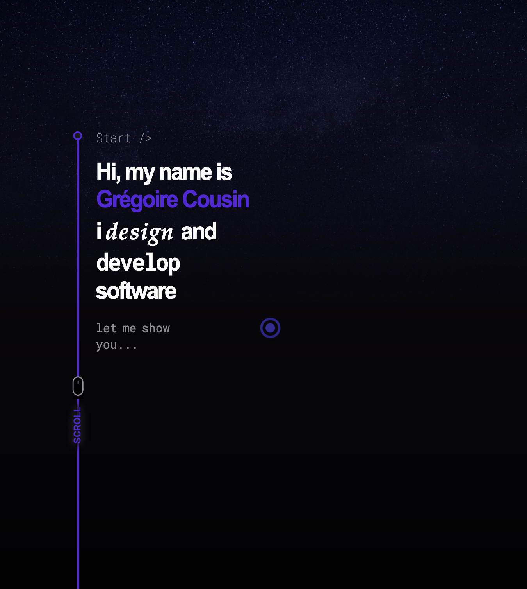

<h1 align="center">Welcome to xotopio 👋</h1>

> My personal website
### 🏠 [Homepage](http://xotopio.com/)

## Prerequisites

- npm >=5.5.0

## Install

```sh
npm install
```

## Usage

```sh
npm run build, then run: npm run start
```

## Author

👤 **Gregoire Cousin**

* Website: [xotopio](http://xotopio.com/)
* Github: [@gregcousin126](https://github.com/gregcousin126)
* LinkedIn: [@gregoire-cousin-1a108236](https://linkedin.com/in/gregoire-cousin-1a108236)

_This website was made with ❤️ by [gregoire cousin](https://github.com/gregcousin126)


## Example: 📸

<br>
